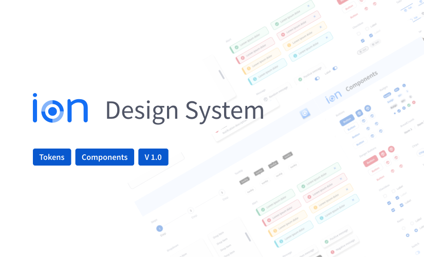

### Angular version

<a href="https://qlty.sh/gh/Brisanet/projects/ion"></a>
<a href="https://qlty.sh/gh/Brisanet/projects/ion"></a>
[](https://github.com/iurynogueira/ion/actions/workflows/prod.yml)
[](https://www.npmjs.com/package/@brisanet/ion)

React version here: https://github.com/iurynogueira/ion-react

## Install in your project

```
npm i @brisanet/ion
```

## Install and run project

To run this project, You will need to use [node v.12](https://nodejs.org/en/)

- Run `git clone https://github.com/Brisanet/ion.git` to get a copy of the repository;
- Run `yarn install` to install all dependencies for the project;
- Run `yarn run storybook` to open the storybook in your localhost.

## Create a component

Run `ng generate component component-name --project=ion` to generate a new component.

## Build

Run `ng build --project=ion` to build the project. The build artifacts will be stored in the `dist/` directory. Use the `--prod` flag for a production build.

## Install, Configure and Use Prettier

Configure Prettier Extension by Vscode

- Install Prettier - Code formatter extension;
- Go to `Settings(JSON)` ;
- Set `"editor.formatOnSave"` true;
- Set `"prettier.eslintIntegration"` true.

## Contribute

Always open discussion to new changes


## Commit pattern

Commits should follow the [convention](https://conventionalcommits.org/).
We have the following types:

- feat: A new feature;
- fix: A bug fix;
- docs: Documentation only changes;
- style: Changes that do not affect the meaning of the code (white-space, formatting, missing semi-colons, etc);
- refactor: A code change that neither fixes a bug nor adds a feature;
- test: Adding missing tests or correcting existing ones;
- chore: Changes to the build process or auxiliary tools and libraries such as documentation generation;
- perf: A code that improves performance;
- ci: Changes to the CI/CD process;
- build: Changes that affect the build system or external dependencies (example scopes: gulp, broccoli, npm);
- temp: Temporary commits that won't be included in your CHANGELOG.

Example: `feat: add feature #issue_id`

## Deploy 🚀

<a href="https://main--62eab350a45bdb0a5818520e.chromatic.com/"> Storybook </a>
