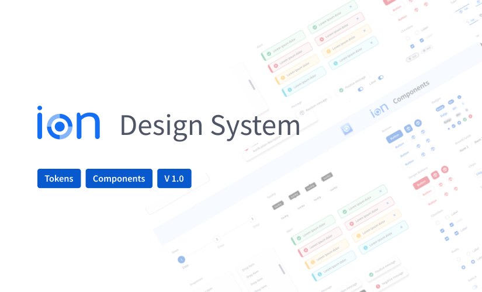

# Ion Design System

Ion is the official **Design System** for **Brisanet**, providing a suite of high-quality components and patterns to ensure consistency, accessibility, and high performance across all our frontend projects.

Built with **Angular**, Ion leverages modern features like **Signals** and **Standalone Components** to offer a developer-friendly experience and scalable architecture.

## 📌 Version Support

We maintain support for multiple Angular versions to ensure compatibility across all internal projects:

| Branch        | Angular Version | Status              |
| :------------ | :-------------- | :------------------ |
| `main`        | v21             | **Active (Stable)** |
| `support/v19` | v19             | Maintenance         |
| `support/v8`  | v8              | Legacy              |

> [!IMPORTANT]
> When starting a new project, always check which version of Angular you are using and pull the corresponding branch.

## 🚀 Key Features

- 💎 **Universal Consistency**: Unified design language for the entire organization.
- ⚡ **High Performance**: Optimized with Angular Signals and `ChangeDetectionStrategy.OnPush`.
- 🎨 **Flexible**: Easily customizable themes and styles.
- 📚 **Interactive Documentation**: Integrated with Storybook for component exploration.
- 🛠️ **Robust Testing**: Fully tested using Jest and Angular Testing Library.

## 📦 Installation

To use Ion in your project, install the package from our internal registry:

```bash
npm install @brisanet/ion
```

## 📖 Usage

Import the components directly into your standalone components:

```typescript
import { IonButtonComponent } from '@brisanet/ion';

@Component({
  selector: 'app-my-component',
  imports: [IonButtonComponent],
  template: ` <ion-button label="Click Me" (ionOnClick)="handleClick()"></ion-button> `,
  changeDetection: ChangeDetectionStrategy.OnPush,
})
export class MyComponent {
  handleClick() {
    console.log('Button clicked!');
  }
}
```

## 🛠️ Development

### Local Setup

Clone the repository and install dependencies:

```bash
git clone https://github.com/Brisanet/ion.git
cd ion
npm install
```

### Storybook

To explore and develop components in isolation:

```bash
npm run storybook
```

### Testing

Run the test suite using Jest:

```bash
npm test
```

### Building

To build the library:

```bash
npm run build
```

The build artifacts will be stored in the `dist/ion` directory.

## 🔄 Maintenance & Synchronization (Cherry-pick)

To keep all supported versions in sync, especially for bug fixes, we use `git cherry-pick`.

### How to propagate a change:

1.  **Commit the change to `main` (with PR, obviously)**:
    Ensure your change is merged and tested in the `main` branch. Note the **Commit Hash**.
    ```bash
    git log --oneline
    ```
2.  **Switch to the target maintenance branch**:
    ```bash
    git checkout support/v19
    ```
3.  **Apply the change using cherry-pick**:
    ```bash
    git cherry-pick -x <commit-hash>
    ```
4.  **Resolve conflicts (if any)**:
    Since different Angular versions might have structural differences, conflicts may occur. Resolve them, then:
    ```bash
    git add .
    git cherry-pick --continue
    ```
5.  **Push the changes**:
    ```bash
    git push origin support/v19
    ```

## 🧱 Project Structure

- `projects/ion`: The core Design System library.
- `projects/ion-test-app`: A showcase and testing application for validating component integration.

## 📋 Rules (.cursor/rules/)

Regras que o Cursor AI segue automaticamente ao trabalhar no projeto.

| Arquivo                  | Tipo          | Descrição                                                                         |
| :----------------------- | :------------ | :-------------------------------------------------------------------------------- |
| `ion-project.mdc`        | `alwaysApply` | Contexto do projeto: tech stack, estrutura, convenções, CI/CD                     |
| `angular-components.mdc` | Dinâmica      | Padrões de componentes: `input()`, `output()`, signals, `OnPush`, host, templates |
| `testing.mdc`            | Dinâmica      | Convenções de teste: Jest + Angular Testing Library, `setInput()`, DOM queries    |
| `storybook.mdc`          | Dinâmica      | Padrões CSF3: `Meta`, `StoryObj`, `argTypes`, providers                           |
| `styling.mdc`            | Dinâmica      | Design tokens SCSS, naming de classes, temas                                      |

> **alwaysApply**: sempre ativa. **Dinâmica**: ativa apenas quando o Cursor detecta relevância pelo glob pattern.

### 🛠️ Skills (.cursor/skills/)

Workflows passo-a-passo invocáveis via `/create-component`, `/write-tests`, `/create-story`.

| Skill              | Descrição                                                                             |
| :----------------- | :------------------------------------------------------------------------------------ |
| `create-component` | Scaffold completo: `.ts`, `.html`, `.scss`, `.spec.ts`, types, `public-api.ts`, story |
| `write-tests`      | Guia para escrever testes cobrindo rendering, inputs, events, estados, a11y           |
| `create-story`     | Criação de stories Storybook com variants e providers                                 |

#### Como usar

No Cursor IDE, as rules já são carregadas automaticamente. Para as skills, digite `/` no chat e selecione o skill desejado (ex: `/create-component`).

## 🤝 Contributing

Ion is a vital organ of Brisanet's frontend ecosystem. Contributions are welcome! Please follow our internal coding standards and ensure all tests pass before submitting a pull request.

---

Made with ❤️ by the **Brisanet** Frontend Team.
